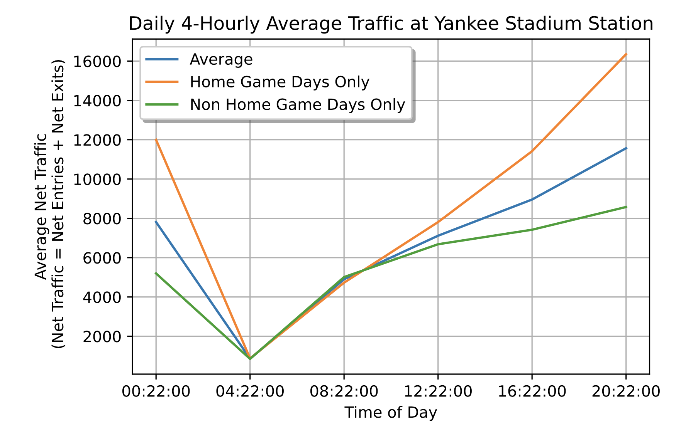

### MVP

*Matteo Fortier*

The initial goal of this project was to analyse the relationship between entertainment events hosted at Madison Square Garden and the foot traffic of surrounding subway stations. Preliminary analysis showed surrounding station '34 ST-PENN STA'  was (*very*) busy, everyday, especially during weekdays. The analysis showed little to no relationship at all between events and foot traffic. Within the context of the project (avoiding crowds, COVID), such findings are not very useful; simply avoid '34 ST-PENN STA' , one of the busiest stations in NYC. 

The focus of the project was pivoted towards stations that weren't located in central Manhattan. Specifically '161/YANKEE STAD', next to the Yankee Stadium and home of the Yankees baseball team. Additional data on Yankees games was used to obtain dates of when the Yankees had home games.


```html

```

The daily 4-hourly average traffic at yankee stadium station was plotted, where 'Net Traffic' is the sum of net entries and net exits of turnstiles in 4 hour intervals. The above figure shows how traffic changes depending on the time of day on average. The average of all days in the dataset is then compared with the average of days only when there are home games as well as days only when there are no home games. 

The figure clearly shows whether there is a home game at Yankee Stadium or not, signficantly relates to a change in foot traffic at Yankee Stadium Station. Specifically: 

- Home games relate to a significant overall increase in foot traffic. 
- Excluding home game days relate to a significant overall decrease in foot traffic, potentially suggesting the large influence of home games on the average traffic of the station (makes sense).
- The above relations do not apply to Midnight to 4am and 4am to 8am intervals, potentally suggesting most games are in the afternoon or evening. 

